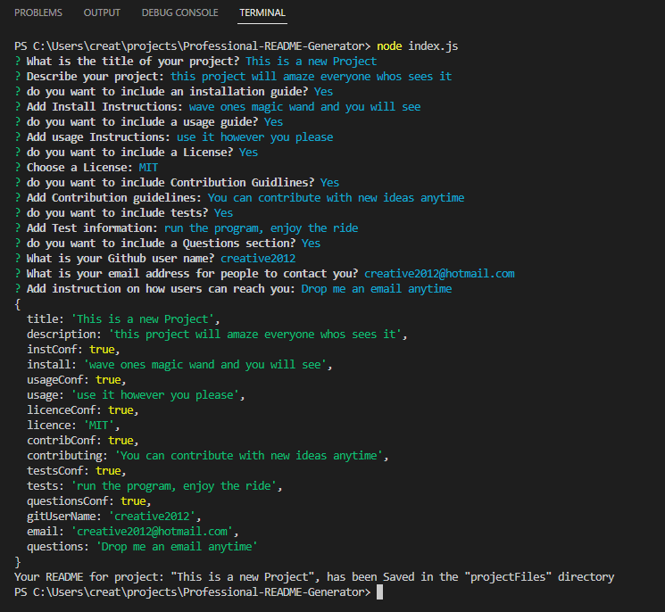

# Professional README Generator
  

## Description
A command-line application to quickly and easily generate a README file. This allows you, the project creator to devote more time to working on the project.

## Table of Contents
* [Installation Instructions](#install)
* [Tests](#tests)
* [Usage Information](#usage)
* [Credits](#credits)
* [Licence](#license)

## Install
clone the repositor to your computer using "git clone" and then follow the tests in the below section

## Tests
1.  Ensure that your application includes the require dependacies, by typing the commnd in your integrated terminal "npm install inquirer@6.5.0".
2.  Create a .gitignore file and include node_modules/ and .DS_Store/ so that your node_modules directory isn't tracked or uploaded to GitHub.
3.  Run “node index.js” to begin.

## Usage
Run “node index.js” and follow the prompts. At the end your new readme file will be stored in a new directory called "projectFiles".

## Credits

Skills for Life Boot Camp

## License

MIT License

Copyright (c) 2022 creative2012

Permission is hereby granted, free of charge, to any person obtaining a copy
of this software and associated documentation files (the "Software"), to deal
in the Software without restriction, including without limitation the rights
to use, copy, modify, merge, publish, distribute, sublicense, and/or sell
copies of the Software, and to permit persons to whom the Software is
furnished to do so, subject to the following conditions:

The above copyright notice and this permission notice shall be included in all
copies or substantial portions of the Software.

THE SOFTWARE IS PROVIDED "AS IS", WITHOUT WARRANTY OF ANY KIND, EXPRESS OR
IMPLIED, INCLUDING BUT NOT LIMITED TO THE WARRANTIES OF MERCHANTABILITY,
FITNESS FOR A PARTICULAR PURPOSE AND NONINFRINGEMENT. IN NO EVENT SHALL THE
AUTHORS OR COPYRIGHT HOLDERS BE LIABLE FOR ANY CLAIM, DAMAGES OR OTHER
LIABILITY, WHETHER IN AN ACTION OF CONTRACT, TORT OR OTHERWISE, ARISING FROM,
OUT OF OR IN CONNECTION WITH THE SOFTWARE OR THE USE OR OTHER DEALINGS IN THE
SOFTWARE.